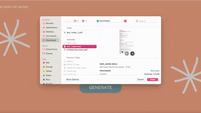

## Project Overview
✨<span style="color:#fe5900; font-weight:700;">TikTokify My Notes</span>✨ is a web app that transforms uploaded notes into short, dynamic audio scripts inspired by popular TikTok videos.🤠 

Users will:
- Upload their notes
- Choose a TikTok style
    - Gentle ASMR ☁️💤
    - Bestie Facetime 💅🏽🤍
    - Juicy Storytime 🫢🤣
    - True Crime Story 🔍🕵🏽‍♂️
- Our website will transform their notes into an audio output in the Tiktok-style chosen!

## How It Works
- The notes uploaded are extracted by our Python code, reviewed for any malicious or inappropriate information 
- Uses gpt-4o-mini model to summarize and extract key points from notes and generate an audio script that can be fed into our Text to Speech translator.
- Uses ElevenLabs model eleven_v3, a very expressive Text to Speech model to transform the notes into an audio 

  

## Technical Architecture

### **Core Technologies**
- **Frontend:** React, TailwindCSS  
- **Backend:** Python (FastAPI)  
- **AI Models:**  
  - OpenAI GPT-4o-mini (notes summarization + audio script generation in specified Tiktok-style)  
  - ElevenLabs V3 (text-to-speech - gives realistic AI voices)  
- **Deployment:** Vercel (Frontend) + Render (Backend)  

### **Technical Features**
- File upload (Supports .pdf, .docx, .txt up to 5MB)
- Input validation + file size/type checks (it checks for any malicious or inappropriate content uploaded before generating an audio output)
- AI-powered summarization + stylistic script generation (was designed to also make sure there are no "hallucinations" when generating the script from the notes so AI is not just making stuff up)
- Supports use of multiple languages: English, Chinese, French, Hindi, Spanish (eg can take your Spanish notes and give you an audio in English and vice versa)
- Audio generation via ElevenLabs API - voices and model used were carefully selected to really capture the Tiktok styles
- Fully responsive UI with animated style selection cards

## Usage & Testing

### **Using the Deployed Application**

The application is live and ready to use! No installation required.

🔗<span style="color:#fe5900; font-weight:700;"> Access the app here:</span> [https://tiktokify-my-notes.vercel.app](https://tiktokify-my-notes.vercel.app)

Note the following before you test
- Please keep the notes uploaded short - Around 200 words (I'll only be generating an audio output of about 1 min so I don't use up all my credits)
- I'm running out of ElevenLabs API credits so don't give tooo many tries (1-5 tries should be fine for the hackathon; just want to be safe)
- The backend server times out after 15 mins of inactivity. If so you will get the error: "Request timed out after 30 seconds. Please try again 🤠" Just give it a minute or two and retry

## Local Development Setup

Or if you would prefer to run this project locally, you need:

### **Software Requirements**
- **Node.js:** v18.0.0 or higher (for React 19+ compatibility)
- **npm:** v9.0.0 or higher (comes with Node.js)
- **Python:** v3.11.0 or higher
- **pip:** Python package installer (comes with Python)

### **API Keys** (Required)
- **OpenAI API Key:** For GPT-4o-mini text generation
  - Get yours at: [https://platform.openai.com/api-keys](https://platform.openai.com/api-keys)
- **ElevenLabs API Key:** For text-to-speech audio generation
  - Get yours at: [https://elevenlabs.io/app/settings/api-keys](https://elevenlabs.io/app/settings/api-keys)

### **Key Dependencies**
**Frontend:**
- React 19.2.0
- TailwindCSS 3.4.18
- React Scripts 5.0.1

**Backend:**
- FastAPI 0.104.1
- Uvicorn 0.23.2
- OpenAI >= 1.0.0
- ElevenLabs >= 1.8.0
- PyPDF2 3.0.1
- python-docx 1.1.0

### **1. Clone the Repository**
```bash
git clone https://github.com/jessicauviovo/tiktokify-my-notes.git
cd tiktokify-my-notes
```

### **2. Set Up the Backend**

#### **a) Navigate to the backend directory**
```bash
cd backend
```

#### **b) Create a virtual environment (recommended)**
```bash
# On macOS/Linux
python3 -m venv venv
source venv/bin/activate

# On Windows
python -m venv venv
venv\Scripts\activate
```

#### **c) Install Python dependencies**
```bash
pip install -r requirements.txt
```

#### **d) Set up environment variables**
Create a `.env` file in the `backend/` directory:
```bash
OPENAI_API_KEY=your_openai_api_key_here
ELEVENLABS_API_KEY=your_elevenlabs_api_key_here
```

#### **e) Run the backend server**
```bash
uvicorn main:app --reload --port 8000
```
The backend will be available at `http://localhost:8000`

### **3. Set Up the Frontend**

#### **a) Open a new terminal and navigate to the project root**
```bash
cd /path/to/tiktokify-my-notes
```

#### **b) Install Node.js dependencies**
```bash
npm install
```

#### **c) Start the React development server**
```bash
npm start
```
The frontend will automatically open at `http://localhost:3000`

### **4. Troubleshooting Local Development**

- **Port already in use:** If port 3000 or 8000 is occupied, you can change them:
  - Frontend: Set `PORT=3001` environment variable before `npm start`
  - Backend: Change `--port 8000` to another port in the uvicorn command
  
- **API Key errors:** Ensure your `.env` file is in the `backend/` directory with valid API keys

- **CORS issues:** Make sure both frontend and backend servers are running simultaneously

- **Module not found errors:** Try deleting `node_modules` and running `npm install` again

## AI Usage Statement

This project leverages AI technologies in the following ways:

### **AI in the Application**
- OpenAI GPT-4o-mini
- ElevenLabs Text-to-Speech (V3)

### **AI in Development**
AI-assisted tools (including ChatGPT and Cline AI) were used during the development process. All AI-generated code was reviewed, tested, and modified by the development team to ensure quality, security, and alignment with project requirements.
